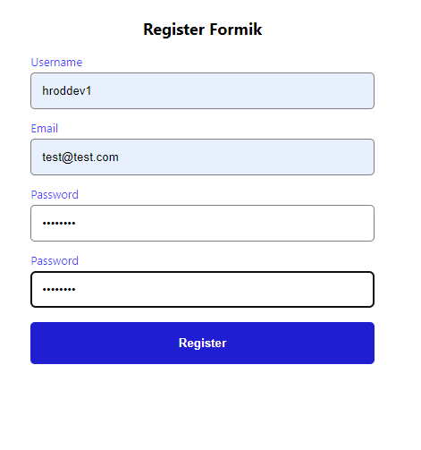

# Ejercicios sesiones 13, 14 y 15

Partiendo del proyecto final, deberéis utilizar crear un formulario con el que crear tareas. Para hacer esto usaréis:

Formik para el formulario.

Yup para las validaciones.

___
## Capturas de pantalla

